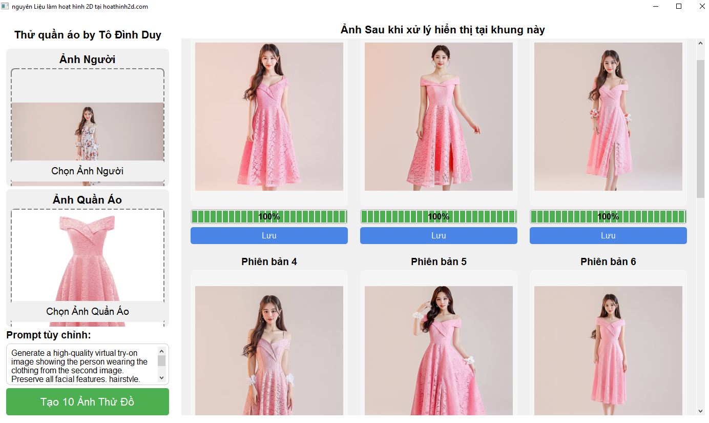

# AI-ClothingTryOn

Ứng dụng desktop Python sử dụng trí tuệ nhân tạo Google Gemini để tạo ảnh thử đồ ảo. Phần mềm cho phép người dùng tải lên ảnh của người và quần áo riêng biệt, sau đó tạo ra các hình ảnh tổng hợp chân thực thể hiện cách người đó sẽ trông như thế nào khi mặc trang phục đã chọn.



 Tính năng

- Tải lên ảnh người và ảnh quần áo riêng biệt
- Tạo 10 phiên bản thử đồ khác nhau
- Tùy chỉnh prompt cho AI để điều chỉnh kết quả
- Lưu kết quả ảnh thử đồ
- Giao diện trực quan, dễ sử dụng
- Khả năng xử lý nhiều ảnh cùng lúc

 Yêu cầu

- Python 3.8+ (cho phát triển)
- Google Gemini API key
- Kết nối internet để gọi API

 Cài đặt

 Phương pháp 1: Sử dụng file EXE (Khuyến nghị cho người dùng)


2.Tải [file ZIP nếu trình duyệt không cho tải Exe ](https://mega.nz/file/pYpkQbzJ#exFxB7T2QhQFbMUzza1xx_KeAajMreSy3MdBgZOKuQM)
3. Giải nén file và chạy `AI-ClothingTryOn.exe`
4. Nhập Google Gemini API key khi được yêu cầu

 Phương pháp 2: Sử dụng mã nguồn (Cho nhà phát triển)

1. Clone repository này:
   ```
   git clone https://github.com/yourusername/AI-ClothingTryOn.git
   cd AI-ClothingTryOn
   ```

2. Cài đặt các thư viện cần thiết:
   ```
   pip install -r requirements.txt
   ```

3. Chạy ứng dụng:
   ```
   python main.py
   ```

Lấy Google Gemini API Key

1. Truy cập [Google AI Studio](https://ai.google.dev/)
2. Đăng ký và đăng nhập vào tài khoản Google của bạn
3. Điều hướng đến phần API Keys và tạo key mới
4. Sao chép API key
5. Dán vào file `api_key.txt` hoặc nhập trực tiếp khi ứng dụng yêu cầu

 Cách sử dụng

1. Chạy ứng dụng
2. Nhấp vào "Chọn Ảnh Người" để tải lên ảnh người mẫu
3. Nhấp vào "Chọn Ảnh Quần Áo" để tải lên ảnh quần áo
4. (Tùy chọn) Điều chỉnh prompt trong hộp văn bản
5. Nhấp vào "Tạo 10 Ảnh Thử Đồ" và đợi kết quả được tạo
6. Sử dụng nút "Lưu" bên dưới mỗi kết quả để lưu ảnh

Cấu trúc dự án

```
AI-ClothingTryOn/
├── main.py               # Mã nguồn chính
├── requirements.txt      # Danh sách thư viện cần thiết
├── api_key.txt           # File chứa API key (không đưa lên git)
├── uploads/              # Thư mục lưu trữ ảnh tải lên
├── results/              # Thư mục lưu trữ ảnh kết quả
└── screenshots/          # Ảnh chụp màn hình cho tài liệu
```

Công nghệ sử dụng

- PyQt6 cho giao diện người dùng
- Google Generative AI (Gemini) cho việc tạo ảnh
- Pillow cho xử lý ảnh
- Threading cho xử lý đa luồng

Lưu ý

- Dự án này sử dụng Google Gemini API và có thể phát sinh phí theo chính sách của Google
- Đảm bảo rằng bạn có quyền sử dụng ảnh bạn tải lên

Đóng góp

Các đóng góp cho dự án luôn được chào đón! Vui lòng làm theo các bước sau:

1. Fork repository
2. Tạo branch mới (`git checkout -b feature/amazing-feature`)
3. Commit thay đổi (`git commit -m 'Add some amazing feature'`)
4. Push lên branch (`git push origin feature/amazing-feature`)
5. Mở Pull Request

 Giấy phép

Phân phối theo giấy phép MIT. Xem `LICENSE` để biết thêm thông tin.

Tô Đình Duy - hoathinh2d.com
